# 🤖 Autonomous AI Software Engineer (DevOps Agent)

> An intelligent, multi-agent system that autonomously triages, fixes, and responds to GitHub issues 24/7.

## 🏗️ System Architecture

Unlike simple "auto-reply" bots, this agent uses a **Semantic Router** to understand the *intent* behind an issue before acting. It does not blindly apply fixes; it thinks first.

```mermaid
graph TD
    A[New GitHub Issue] --> B{AI Router / Classifier}
    B -- "Bug" --> C[👷 Engineer Agent]
    B -- "Feature Request" --> D[📐 Architect Agent]
    B -- "Question" --> E[👨‍🏫 Tutor Agent]
    C --> F[Fix Code via LLM]
    D --> G[Draft Tech Implementation Plan]
    E --> H[Explain Concept with Analogies]
    F --> I[Post Comment to GitHub]
    G --> I
    H --> I
    I --> J[📧 Email Notification to Admin]
```

**`🧠 How It Works`**
The system operates on a Logic-First pipeline:

Trigger: Watches for new issues in real-time.

Classification: A dedicated LLM (Llama-3-70b via Groq) analyzes the issue title and body to determine intent:

Bug: Code error, crash, or unexpected behavior.

Feature: Request for new functionality or enhancements.

Question: Educational queries or confusion.

Routing: The Switch Node directs the workflow to the specialized agent.

Execution:

The Engineer analyzes code context and suggests a patch.

The Architect outlines a technical requirements document.

The Tutor provides a pedagogical explanation.

Notification: The system posts the solution to GitHub and alerts the maintainer via Email.

🛠️ Tech Stack
Orchestration: n8n (Workflow Automation)

AI Inference: Groq Cloud (LPU Inference Engine)

LLM: Llama-3.3-70b-Versatile

Version Control: GitHub API

🚀 Why I Built This
To solve the problem of "Context Switching." As a developer, stopping to triage minor bugs or answer questions breaks flow. This agent handles the "Level 1" support autonomously, allowing humans to focus on complex engineering.
